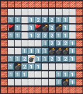

# Minesweeper JS

A simple emoji based Minesweeper clone, playable on the CLI!

## Usage

Download by cloning this repository, start it by running `node minesweeper.js` or executing `npx minesweeper.js`

## Arguments

 * `--width=number` - Width of the field, defaults to `8`
 * `--height=number` - Height of the field, defaults to `8`
 * `--mines=number` - Number of mines to place on the board, defaults to `10`

## Detailed explanation

See my post over on `dev.to/thormeier`!

## License

MIT
